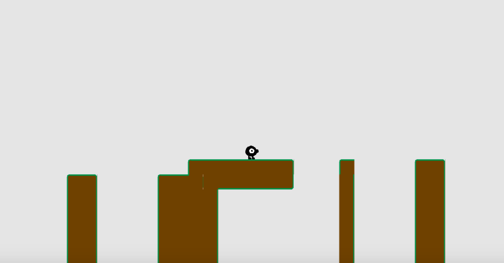
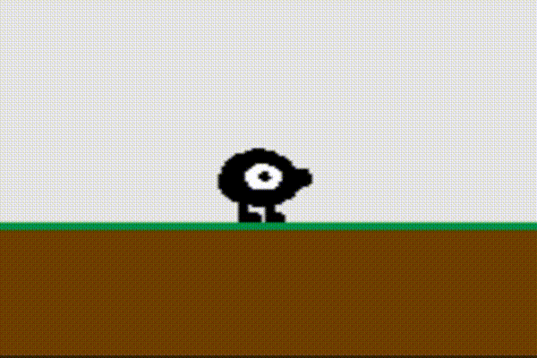

# platformer-gen-2D
A playable 2D platformer with a procedural level generator, made with Typescript and WebGL

## Overview
So far, I have a playable prototype that runs via WebGl. It currently runs at a consistent 30FPS (it's actually been running at 60FPS, but apparently I made a change that halved the framerate shortly before submitting this progress report. It's very likely just a small bug, and while I'm unable to fix this issue today, it should be fixed very soon). I have the foundations of a level generator as well, which can generate a rhythm containing jumps of different heights in a regular pattern. I have the basic code for the geometry generator written too. However, due to the way I implement jumping, the problem of finding the exact trajectory of a jump based off of the physics model is a bit more mathematically intense than I originally thought. I still intend to solve it obviously, but in order to demostrate my level generator so far for this progress report, I've hardcoded some grammar rules based on 3 different jump heights that work with the default model.
To play, simply use the 'a' and 'd' keys to move laterally, and the 'w' key to jump. These controls are subject to change.

## Work Completed
- As of now, the game engine is in a working state. Collision works mostly as expected (except for the case where the player jumps into the underside of a tile, although this case isn't possible to encounter in the generated levels). The player can move around and jump using the keyboard, and, importantly, the height of the jump depends on how long the key is held, to a certain point.
- I managed to modify the starter code of previous assignments to be optimized for an orthographic 2D platformer. In addition to changing the size of the VBOs (they need 1 less dimension now), I've simplified the camera class to be better suited to the engine.
- I created a simple spritesheet, as seen below. Note that I will certainly change the terrain sprites, as well as the "death" (which is meant to be a spikey ball obstacle), which are for now just drawn as placeholders. I also made a class to import the texture and send it to the fragment shader.

- I created a class to easily handle 2D, grid-based terrain. My level generator simply needs to enter some world coordinates, and terrain will be generated in that location. When determining the UV coordinates of a tile, the adjacent tiles are checked to make sure the correct one is chosen, i.e., the correct sprite is found automatically (there are a couple situations that I haven't made terrain sprites for, which results in what appear to be incorrect sprites for some terrain tiles. I'm either going to add more sprites to remedy this, or adjust the level editor to prevent these kinds of tiles from generated). The tiles themselves are drawn with instanced geometry.
- The level generator currently supports jumps, but not waiting. Note that, as per the referenced paper, the "Jump time" refers not to the amount of time spent in the air, but the amount of time the jump button is held, which is why it was crucial that holding the jump button for varying amounts of time affects the player's jump height. The geometry generator currently uses hardcoded patterns instead of using the physics model to determine where jumps start or end. See the overview for more details.

## Work To Do
- Obviously, I need to have the level generator figure out how long each jump is from the physics model alone so that these parameters can be tweaked by the user without breaking the generator. This is what I consider the highest priority feature I need to implement.
    - I'm also aware that some levels dip too low or go to high and the camera movement does not accomodate. I'm obviously going to work on that.
- I need to incorporate movement states into the level generator, which means I'm going to have to implement a mechanic that requires waiting (such as moving platforms or some sort of simple thwomp-like enemy)
- I'd like to implement spikey death balls to add some variety to the geometry generator, i.e., I'd like the player to jump over something other than a chasm.
- If time permits, I'd like to add a greater sense of horizontal momentum to the player, because right now he can start and stop with no acceleration. That's more of a game design feature than a procedural graphics one, so it's low priority right now.
- The terrain is ugly right now and I'd like to repsrite it. I'd like to get a background in there too.
- I want to add in collectibles via a global pass (I already have a sprite drawn), even if they don't do anything

## Demo
The live github demo can be found here: https://sgalban.github.io/platformer-gen-2D/
While the demo does feature what I have so far of level generation and the basic game engine, I can't seem to get it to load the spritesheet, so every sprite and tile appears as a black square, and none of the animation can be seen. If you were to download the repo and run it on localhost, everything should appear as expected. By the final due date, I do plan on figuring out how to get that to work (and if you have any suggestions, I would appreciate hearing them);

## Sources
-https://learnopengl.com/In-Practice/2D-Game/Rendering-Sprites
-https://developer.mozilla.org/en-US/docs/Web/API/WebGL_API/Tutorial/Using_textures_in_WebGL
-https://users.soe.ucsc.edu/~ejw/papers/smith-platformer-generation-fdg2009.pdf

