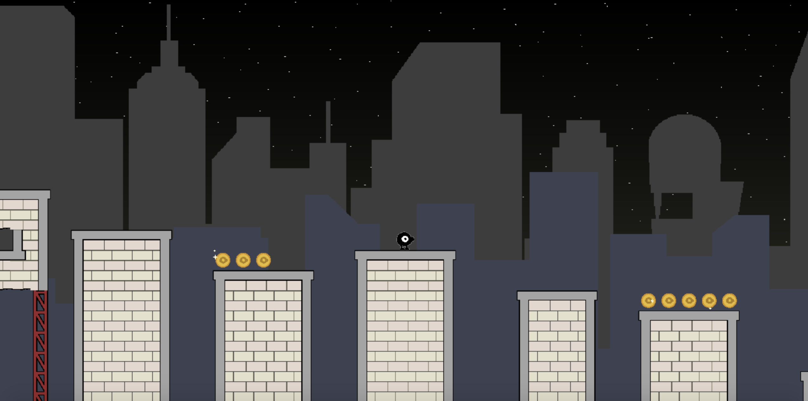
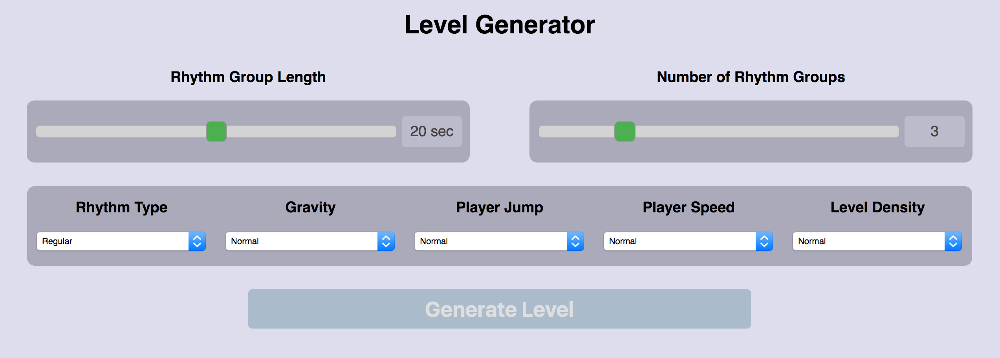
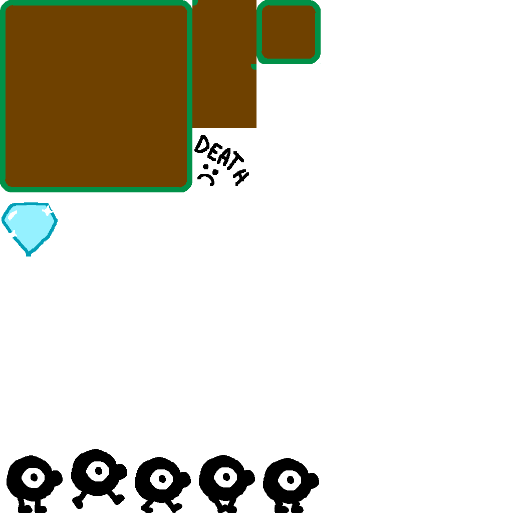
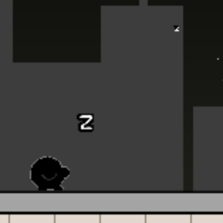

# platformer-gen-2D
A playable 2D platformer with a procedural level generator, made with Typescript and WebGL.

## Overview
This project contains 2 primary distinct, but related, components: a game engine and a level editor. The engine is obviously very simple and is optimized to run this particular game, but while developing it, I tried to keep it as robust as possible where I didn't have to sacrifice efficiency. The level generator was heavily inspired by "Rhythm-Based Level Generation for 2D Platformers", a paper written by Gillian Smith, Mike Treanor, Jim Whitehead, and Michael Mateas at the University of California (as of April 2019, the paper can be found [here](https://users.soe.ucsc.edu/~ejw/papers/smith-platformer-generation-fdg2009.pdf)). See below for a detailed account of how all the different aspects of this project were implemented. 

__A live demo can be found [here](https://sgalban.github.io/platformer-gen-2D/)__

### How To Play
#### Generating a level
When the game is first opened, a screen with level generation options appears.

These controls have the following effects:
 - "Rhythm Group Length" determines the approximate length, in seconds, of the rhythm groups (i.e. the platforming chunks between rest areas). This time is based on optimal gameplay, and even then is only an approximation, but generally, the longer the time in seconds, the more obstacles there will be.
 - "Number of Rhythm Groups" dictates how many groups there will be. For example, a level with 4 groups will be about twice as long as one with only 2.
 - "Rhythm Type" determines how the jumps in each rhythm group are spaced:
     - "Regular" evenly spaces each jump
     - "Random" places jumps randomly within a rhythm group
     - "Swing" will alternate between putting a long distance between jumps and a short one
     - "Regular and Swing" will give some groups a regular rhythm, and give others a swing rhythm, with an equal probability. An individual group will only ever have a single rhythm type.
 - "Gravity" alters how quickly the player accelerates downward, shortening the maximum jump height and making the jump faster.
 - "Player Jump" alters the velocity with which the player jumps off the ground. Stronger jumps have a higher maximum height.
 - "Player Speed" changes the running speed of the character. The higher the speed, the more distance an be covered with a jump.
 - "Level Density" determines how frequently jumps appear. Higher density levels have more obstacles and are thus harder.

Most of these options are dropdown menus instead of sliders, as my level generator begins making levels that are too hard or just don't look quite right at high enough extremes. Still, these options give the levels a high degree of customizability.

#### Controls
Use the left and right arrow keys to move horizontally (alternatively, 'a' and 'd' work as well). Press 'w' the up arrow, or the spacebar to jump. The longer the jump key is held, the higher you'll jump. Holding 's' or the down arrow will let you crouch, shifting the camera down slightly and allowing you to see what's below you. There are no secrets or hidden collectibles: the only goal is to get to the end of the level on the far right and collet the gem. There are coins that can be picked up, but for now, these are used only to guide the player and serve no functional purpose.

## Game Engine
- The WebGL has been optimized for an orthographic 2D platformer. In particular, I avoid dealing with attributes associated with persepective cameras (FOV, clip planes, etc), and my VBO's contain only 2 dimensions of positional data.
- With the exception of the backgrounds, every terrain tile and game object is drawn as an instanced 1x1 square. Despite being instanced, a moderate number of instanced VBOs are processed to allow for a lot of variety between sprites. This includes VBOs to determine the sprite offset, UV offset (to read from the spritesheet), the sprite scale, and whether or not the sprite should be mirrored along the vertical axis. Of course, all these graphical features are implemented in the sprite shader program. Simple animations can be implemented by simply changing the values of the UV offset.

- The background is drawn as a single screen-space plane with a unique shader program. The different layers of the skyline were drawn separately (on the same image) and imported as a texture, but the actual parallax effect, as well as the starry sky, were done entirely on the shader. In particular, the vertex shader computes 2 different UV coordinates, one for the front layer and one for the back layer. These coordinates are offset using camera's current position, which is fed to the GPU through a uniform. These offsets are heavily dampened to prevent them from scrolling too quickly, the dampening on the back layer's UVs is greater, creating a parallax. The offset in both of these layers occurs vertically as well, but this effect is more subtle. Within the fragment shader, the fragment reads from the background texture using the front layer's UV. If the pixel is transparent, it uses the back layer's UVs instead, and if that one is also transparent, a procedurally generated starry sky is drawn. The sky itself is pretty simple: worley noise is generated, and the fragments within a small radius of the centers of the cells are drawn white to represent stars. These radii are altered sinusoidally with time, with a random offset, creating a twinkling effect.

- The engine itself stores a collection of GameObjects. Each GameObject adds itself to this collection when it's constructed. Every tick, the position of the GameObjects are updated (unless flagged as "passive") using the scene's physics, which includes applying gravity, and checking for and responding to collisions. Several functions, which can be implemented in the GameObject subclasses, are also called as appropriate, including onUpdate, onCollision, onKeyDown, etc.
    - Checking for collisions is very simple, as each object is treated as a 1x1 box. To respond to a collision, an object's position is altered to move it just outside the colliding object, one axis at a time, as is standard. Non-dynamic objects can still check for collisions, but this only envokes an optional callback, and they don't bother physically responding.
    - As an anti-frustration feature, I specifically treat spike balls as 0-dimensional points when calculating collisions. This makes jumping over spike columns much less tedious.
- In order to get the player to "feel" right, I introduced an "input velocity" vector that can be changed from the Player subclass. During a physics update, the engine attempts to set the current velocity to the input velocity. However, horizontal change in velocity caused by changes in input velocity is dampened, giving the player a sense of momentumm. This dampening is increased when the player is in the air, making controlling speed after initiating a jump more difficult, though not impossible.
    - Pressing a jump key will increase the vertical input velocity. Instead of resetting back to 0 after 1 frame, the vertical input velocity will remain positive for a certain amount of time as long as the jump key is being held (however, the input velocity decreases as the key is held. While the result still isn't quite phyiscally accurate, this makes the positive upward acceleration less noticable, preventing a "jetpack" effect while jumping). This is important not only to improve gamefeel, but it gives the players more control over their jumps, which is an important factor of the level generation.
- The camera does not follow the player's movement one-to-one, as that would be distracting when jumping. Instead, while the camera perfectly tracks the player's horizontal movement, it treats the player's vertical height as sort of a "goal height". Every frame, the camera will move some fraction of the way between its current height and its goal height. This fraction is higher when the player is grounded, so the camera is generally on the player, but moves much less during jumps.
- Particles are implemented as non-collidable GameObjects. A particle's UV offset, lifetime, and movement behavior can be provided via the constructor and setter methods, meaning multiple types of particles can be added with only a single class. Currently, several types of particles are used, mostly to add some visual polish to the game
    - When the player rapidly changes direction, some dust clouds are formed due to the "skidding".
    - When landing on the ground with enough downward velocity, dust will briefly rise up.
    - When the player is idle for long enough, the player will enter a sleeping animation, and small "z" particles will flow out of him.
    - Coins will occasionally generate "sparkle" particles which quickly expand and then shrink out of existence.
    - These same sparks will radiate outward briefly after collecting a coin.

## Level Generation
- While the terrain sprites are in the same file as the GameObject sprites, terrain is not implemented as a GameObject. Instead, it is implemented as a grid of booleans (in particular, a nested map). I abstracted enough of this away to the point where a terrain tile can be added simply by passing the coordinates to a function (a column can be generated in the same way). When the terrain is drawn, each tile checks its adjacent tiles to procedurally determine which sprite to draw with. While there are some configurations that I didn't bother drawing sprites for, they won't appear in naturally generated levels.
    - Despite not being GameObjects, collision checks are basically the same. The difference is that each non-passive GameObject only checks the adjacent 9 tiles for collisions.
    - Certain terrain sprites are based on a noise function, providing some pseudo-random variation.
- When generating a level, first, the rhythm of each rhythm group is generated using the options set by the player. The linked paper can provide more details, but I never ended up implementing waiting, partially because I ran out of time to create gameplay elements that would give waiting meaning, and partially because waiting in a platformer is kind of boring. Thus, the rhythm generation only determines the start time of the jump, and how long each jump should be held.
    - I predefined 3 jump hold times, but in theory, there could have been a continuous range.
- For each rhythm, geometry is generated around it. I used a grammar-like approach, but the actual implementation avoids formal grammars and is much more ad-hoc (which, given the scale of the project, works just fine).
    - First, the height, length, and time of a jump is calculated using a combination of a simulation (for the upward portion of the jump), and some simple ballistic calculations (for the downward portion). These values are calculated based on the physical attributes set by the player, as well as the hold times determined by the rhythm generator.
    - The jump itself is chosen from one of 3 types:
        - A simple jump. Vertically, the next platform can be anywhere from the jump's peak, to a couple tiles below the jump starting height.
        - A jump through a gap in a column of spikes. Touching a spike will result in death.
        - A jump over or under some spikes and over a gap.
    - The remaining time until the next jump starts is considered a "moving" state. It can become one of 2 terminals
        - A simple flat path.
        - A gentle decline; either 1 or 2 tiles downward.
- Between each rhythm group, a longer "rest area" is placed that gives the player time to cool down. Each one, except for the final one, contains a checkpoint flag. Once the player touches the flag, they'll respawn there upon death instead of the beginning of the level.
- Finally, a global pass scans the entire geometry, and separates the different platforms
    - A platform is a continuous, perfectly flat row of tiles that the player can safely stand on.
    - Randomly, a platform can be completely covered with coins, or an unkillable enemy that moves back and forth will spawn on it. Enemies won't spawn on rest platforms, and won't spawn on platforms that are under 3 blocks wide

## Sources
- https://learnopengl.com/In-Practice/2D-Game/Rendering-Sprites
- https://developer.mozilla.org/en-US/docs/Web/API/WebGL_API/Tutorial/Using_textures_in_WebGL
- https://users.soe.ucsc.edu/~ejw/papers/smith-platformer-generation-fdg2009.pdf

